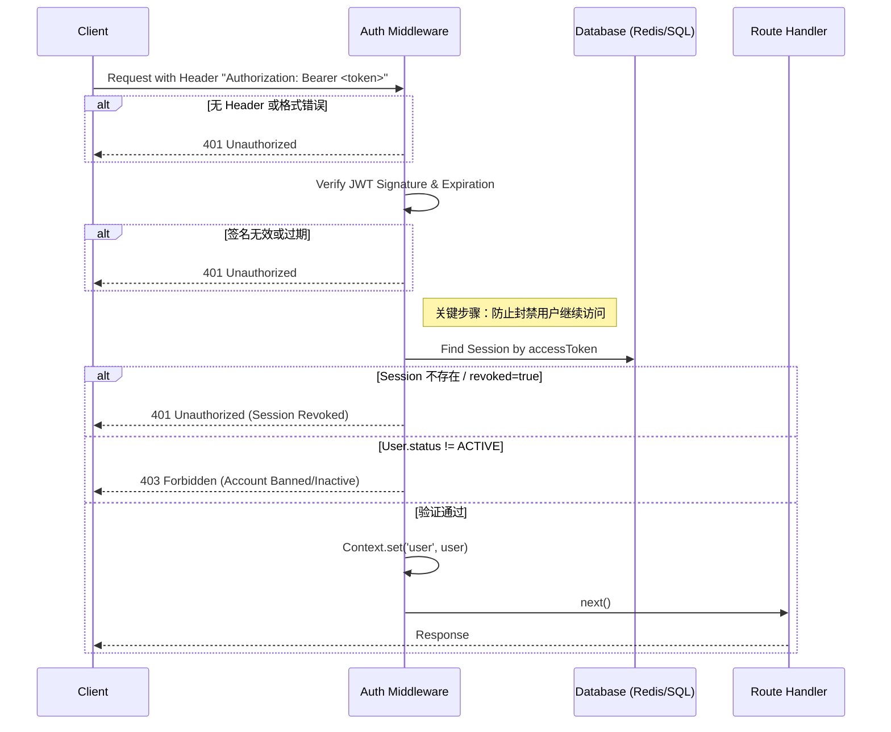

# 请求认证流程 (Auth Middleware Flow)

```mermaid
sequenceDiagram
    participant Client
    participant Middleware as Auth Middleware
    participant DB as Database (Redis/SQL)
    participant Handler as Route Handler

    Client->>Middleware: Request with Header "Authorization: Bearer <token>"

    %% 1. 格式检查
    alt 无 Header 或格式错误
        Middleware-->>Client: 401 Unauthorized
    end

    %% 2. JWT 签名验证 (无状态)
    Middleware->>Middleware: Verify JWT Signature & Expiration
    alt 签名无效或过期
        Middleware-->>Client: 401 Unauthorized
    end

    %% 3. Session 状态检查 (有状态 - 安全核心)
    Note right of Middleware: 关键步骤：防止封禁用户继续访问
    Middleware->>DB: Find Session by accessToken
    
    alt Session 不存在 / revoked=true
        Middleware-->>Client: 401 Unauthorized (Session Revoked)
    else User.status != ACTIVE
        Middleware-->>Client: 403 Forbidden (Account Banned/Inactive)
    else 验证通过
        %% 4. 注入上下文
        Middleware->>Middleware: Context.set('user', user)
        Middleware->>Handler: next()
        Handler-->>Client: Response
    end
```
