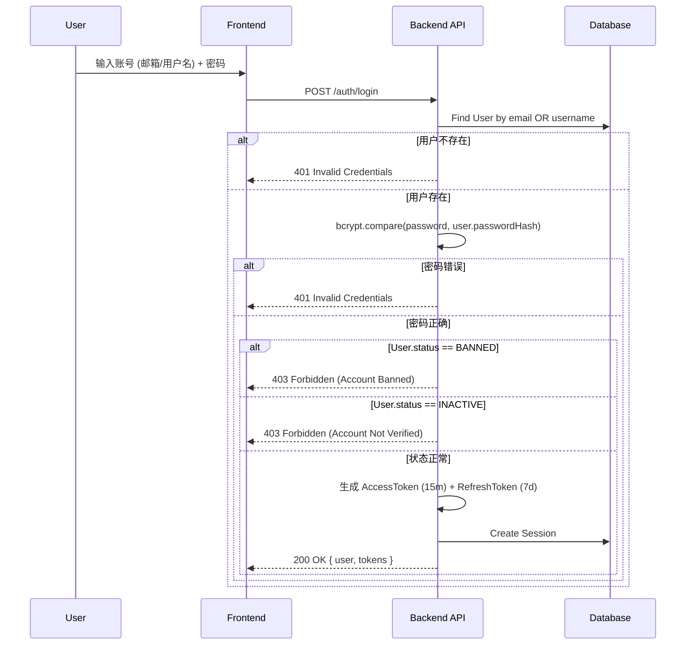

# 登录流程 (Login Flow)

```mermaid
sequenceDiagram
    participant U as User
    participant FE as Frontend
    participant API as Backend API
    participant DB as Database

    U->>FE: 输入账号 (邮箱/用户名) + 密码
    FE->>API: POST /auth/login

    %% 1. 查找用户
    API->>DB: Find User by email OR username
    
    alt 用户不存在
        API-->>FE: 401 Invalid Credentials
    else 用户存在
        %% 2. 验证密码
        API->>API: bcrypt.compare(password, user.passwordHash)
        
        alt 密码错误
            API-->>FE: 401 Invalid Credentials
        else 密码正确
            %% 3. 检查状态
            alt User.status == BANNED
                API-->>FE: 403 Forbidden (Account Banned)
            else User.status == INACTIVE
                API-->>FE: 403 Forbidden (Account Not Verified)
            else 状态正常
                %% 4. 生成 Token
                API->>API: 生成 AccessToken (15m) + RefreshToken (7d)
                
                %% 5. 创建会话
                API->>DB: Create Session
                
                API-->>FE: 200 OK { user, tokens }
            end
        end
    end
```
