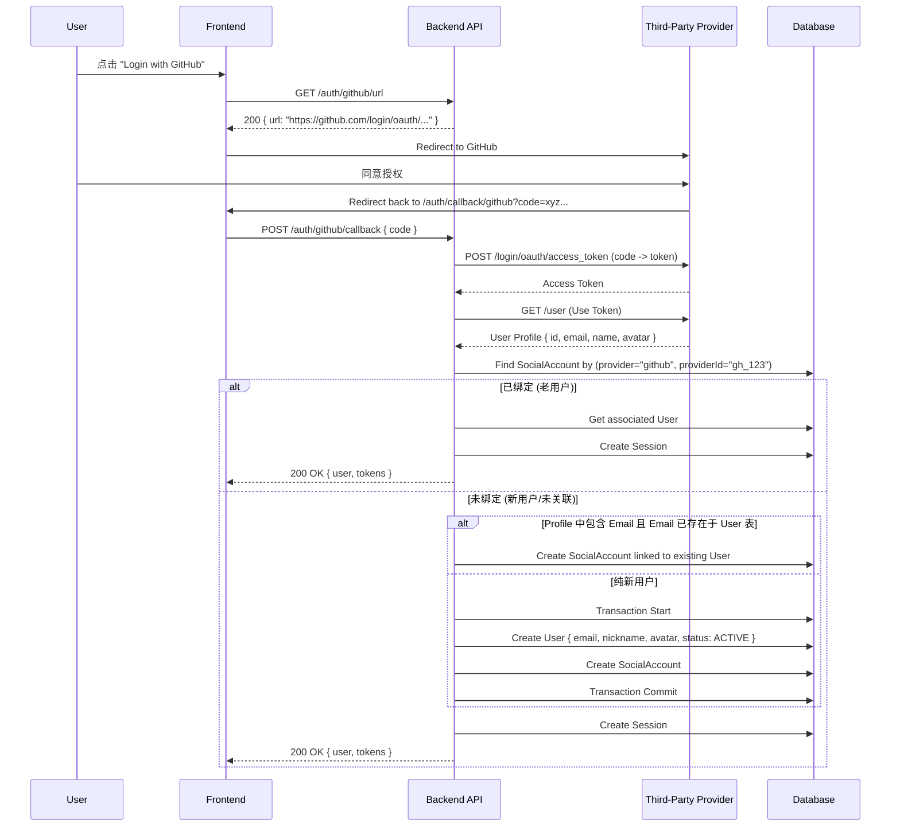

# OAuth 第三方登录流程 (OAuth Flow)

```mermaid
sequenceDiagram
    participant U as User
    participant FE as Frontend
    participant API as Backend API
    participant GitHub as Third-Party Provider
    participant DB as Database

    %% 1. 获取授权链接
    U->>FE: 点击 "Login with GitHub"
    FE->>API: GET /auth/github/url
    API-->>FE: 200 { url: "https://github.com/login/oauth/..." }
    
    %% 2. 用户授权
    FE->>GitHub: Redirect to GitHub
    U->>GitHub: 同意授权
    GitHub->>FE: Redirect back to /auth/callback/github?code=xyz...

    %% 3. 后端回调处理
    FE->>API: POST /auth/github/callback { code }
    
    %% 4. 换取用户信息
    API->>GitHub: POST /login/oauth/access_token (code -> token)
    GitHub-->>API: Access Token
    API->>GitHub: GET /user (Use Token)
    GitHub-->>API: User Profile { id, email, name, avatar }

    %% 5. 账号绑定/创建逻辑
    API->>DB: Find SocialAccount by (provider="github", providerId="gh_123")
    
    alt 已绑定 (老用户)
        API->>DB: Get associated User
        API->>DB: Create Session
        API-->>FE: 200 OK { user, tokens }
    else 未绑定 (新用户/未关联)
        alt Profile 中包含 Email 且 Email 已存在于 User 表
            %% 自动关联现有账号
            API->>DB: Create SocialAccount linked to existing User
        else 纯新用户
            %% 自动注册
            API->>DB: Transaction Start
            API->>DB: Create User { email, nickname, avatar, status: ACTIVE }
            API->>DB: Create SocialAccount
            API->>DB: Transaction Commit
        end
        API->>DB: Create Session
        API-->>FE: 200 OK { user, tokens }
    end
```
