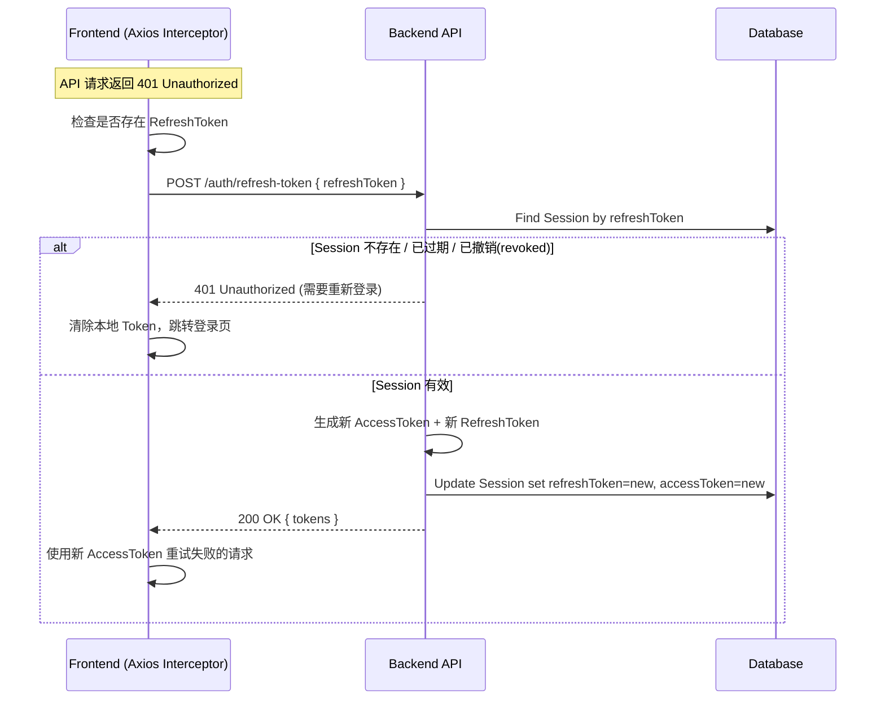

# Token 刷新流程 (Token Refresh Flow)

```mermaid
sequenceDiagram
    participant FE as Frontend (Axios Interceptor)
    participant API as Backend API
    participant DB as Database

    %% 1. 触发刷新
    Note over FE: API 请求返回 401 Unauthorized
    FE->>FE: 检查是否存在 RefreshToken
    FE->>API: POST /auth/refresh-token { refreshToken }

    %% 2. 校验 Refresh Token
    API->>DB: Find Session by refreshToken
    
    alt Session 不存在 / 已过期 / 已撤销(revoked)
        API-->>FE: 401 Unauthorized (需要重新登录)
        FE->>FE: 清除本地 Token，跳转登录页
    else Session 有效
        %% 3. 轮换 Token (Security Best Practice)
        API->>API: 生成新 AccessToken + 新 RefreshToken
        
        %% 4. 更新数据库
        API->>DB: Update Session set refreshToken=new, accessToken=new
        
        API-->>FE: 200 OK { tokens }
        
        %% 5. 重试原请求
        FE->>FE: 使用新 AccessToken 重试失败的请求
    end
```
