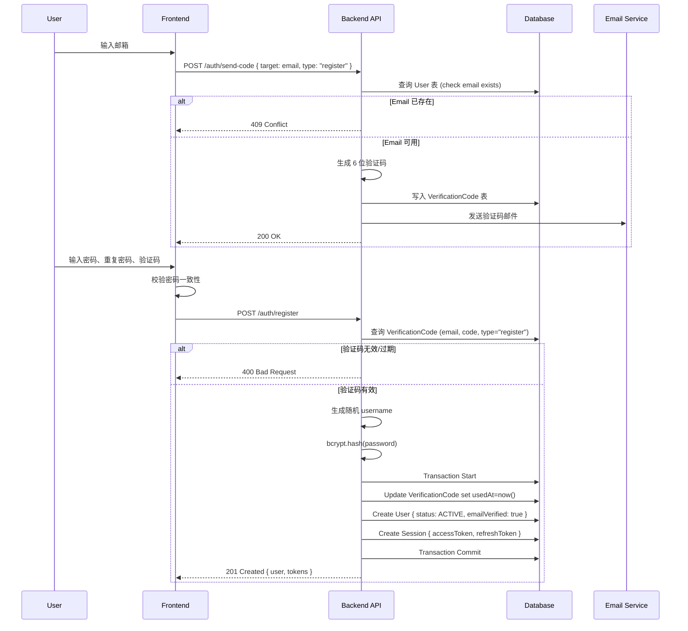

# 注册流程 (Registration Flow)

```mermaid
sequenceDiagram
    participant U as User
    participant FE as Frontend
    participant API as Backend API
    participant DB as Database
    participant Email as Email Service

    %% 1. 发送验证码
    U->>FE: 输入邮箱
    FE->>API: POST /auth/send-code { target: email, type: "register" }
    API->>DB: 查询 User 表 (check email exists)
    alt Email 已存在
        API-->>FE: 409 Conflict
    else Email 可用
        API->>API: 生成 6 位验证码
        API->>DB: 写入 VerificationCode 表
        API->>Email: 发送验证码邮件
        API-->>FE: 200 OK
    end

    %% 2. 提交注册
    U->>FE: 输入密码、重复密码、验证码
    FE->>FE: 校验密码一致性
    FE->>API: POST /auth/register
    
    API->>DB: 查询 VerificationCode (email, code, type="register")
    alt 验证码无效/过期
        API-->>FE: 400 Bad Request
    else 验证码有效
        API->>API: 生成随机 username
        API->>API: bcrypt.hash(password)
        
        API->>DB: Transaction Start
        API->>DB: Update VerificationCode set usedAt=now()
        API->>DB: Create User { status: ACTIVE, emailVerified: true }
        API->>DB: Create Session { accessToken, refreshToken }
        API->>DB: Transaction Commit
        
        API-->>FE: 201 Created { user, tokens }
    end
```
