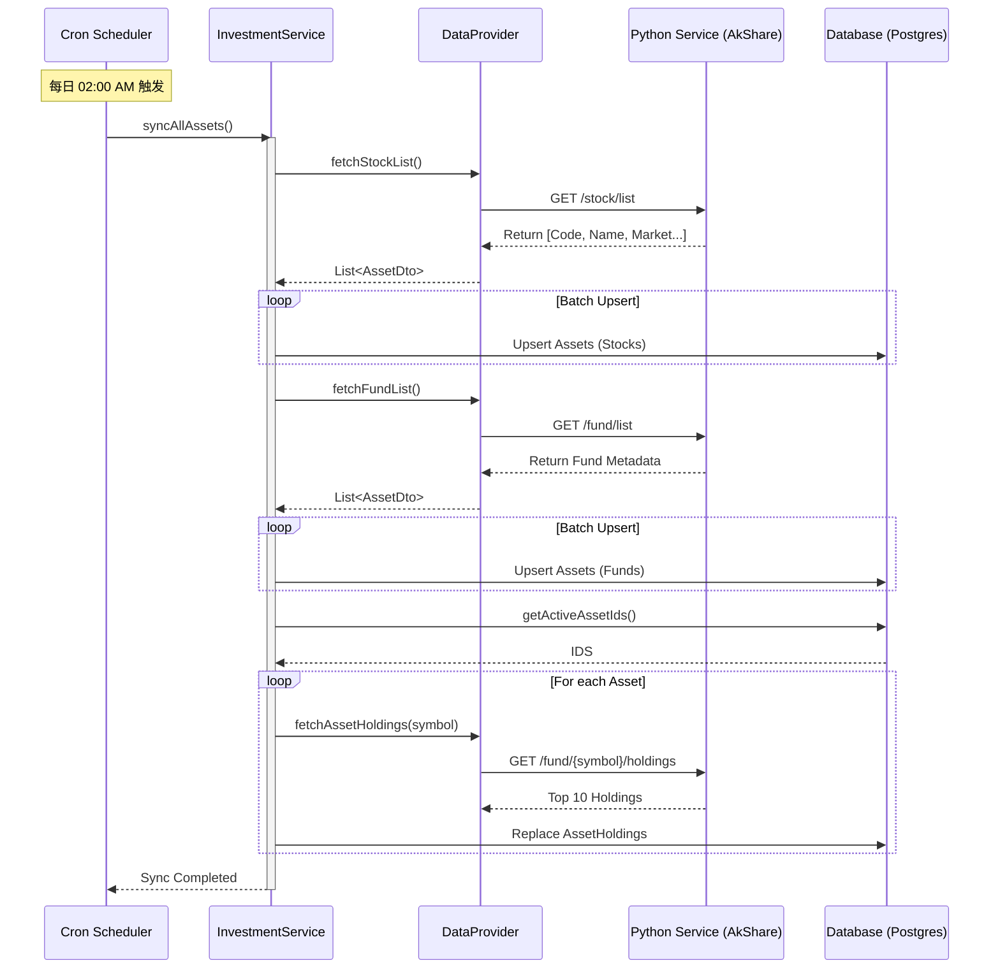

# 资产同步流程 (Asset Sync Flow)

## 概述
系统通过定时任务 (Cron Job) 每日从 Python 微服务 (AkShare) 拉取最新的股票、基金和 ETF 列表，以及热门标的的重仓股数据，并将其持久化到 PostgreSQL 数据库中。这确保了用户在搜索标的时能获取到最新的数据。

## 参与组件
1.  **Cron Scheduler**: 定时任务调度器 (Server)。
2.  **InvestmentService**: 负责编排同步逻辑。
3.  **DataProvider**: 负责与 `services/financial-data` 通信。
4.  **Python Service**: 封装 AkShare 的微服务。
5.  **PostgreSQL**: 存储 `assets` 和 `asset_holdings` 表。

## 流程图

## 关键逻辑
1.  **Upsert 策略**: 使用 `symbol + market` 作为唯一键进行 Upsert (Create or Update)。
2.  **错误处理**: 单个批次失败不应中断整个同步流程，应记录错误日志并继续下一批次。
3.  **流量控制**: 在同步重仓股时（涉及大量 HTTP 请求），应加入适当的延迟 (Sleep) 或并发限制，避免触发上游 API 限制。
