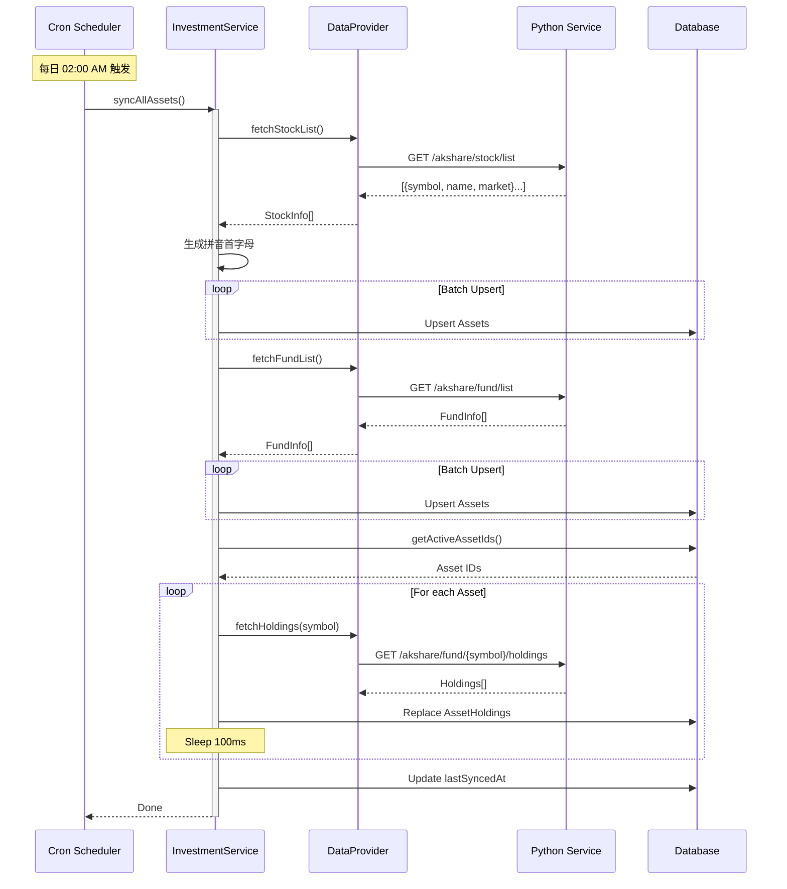

# 资产同步流程 (Asset Sync Flow)

## 概述
系统通过定时任务 (Cron Job) 每日从 Python 微服务拉取最新的股票、基金列表，并持久化到数据库中。

## 参与组件
1.  **Cron Scheduler**: Node.js 定时任务
2.  **InvestmentService**: 编排同步逻辑
3.  **DataProvider**: HTTP 客户端
4.  **Python Service**: 模块化数据服务
5.  **PostgreSQL**: 存储

## 流程图

## 关键逻辑

1.  **Upsert**: `market + symbol` 唯一键
2.  **拼音首字母**: 同步时生成 `pinyinInitial`
3.  **流量控制**: 每次请求间隔 100ms
4.  **同步时间**: 更新 `lastSyncedAt`
