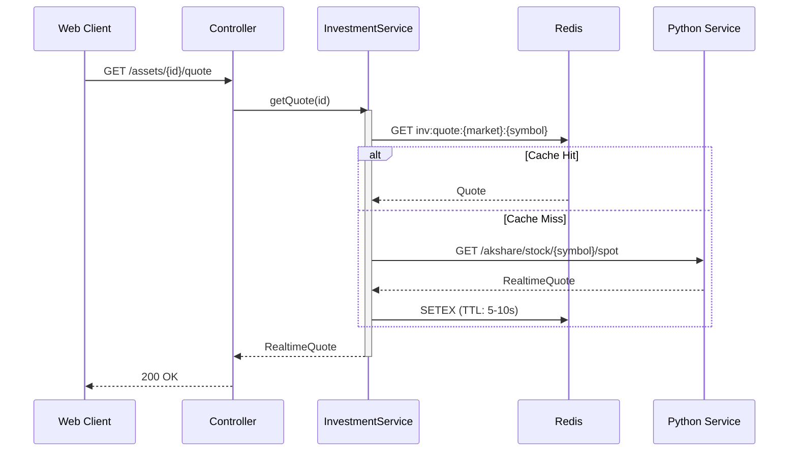
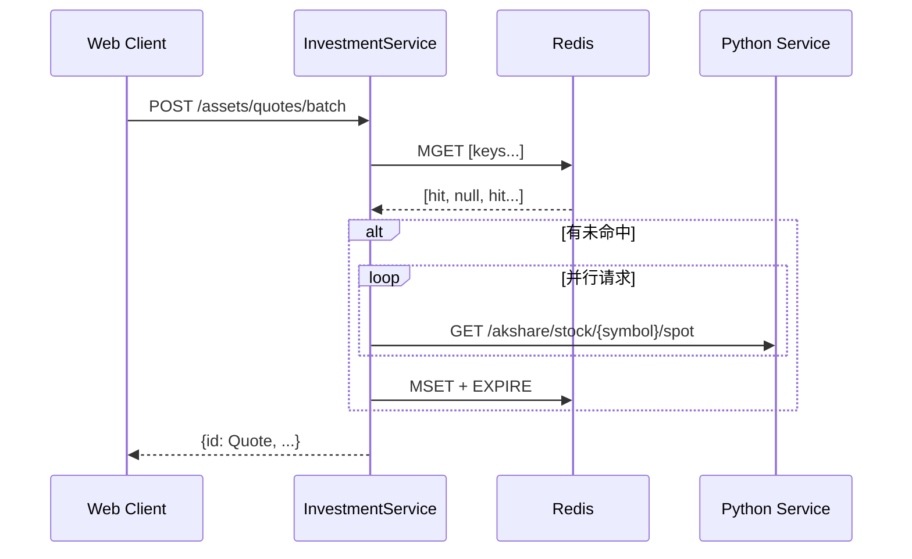
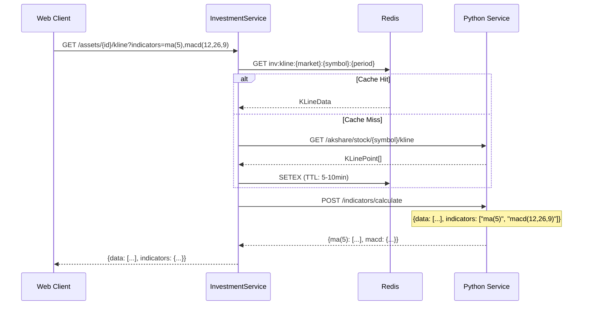

# 实时行情流程 (Realtime Quote Flow)

## 概述
前端轮询后端获取行情数据，后端采用 Redis 缓存 + Python 服务的多级架构。

## 参与组件
1.  **Web Client**: TanStack Query (Polling)
2.  **InvestmentController**: HTTP 入口
3.  **InvestmentService**: 缓存逻辑
4.  **Redis**: 缓存层
5.  **Python Service**: 数据源

## 单个行情查询

## 批量行情查询

## K 线 + 指标查询

## Redis Key 规范

| 类型 | Key | TTL |
|:-----|:----|:----|
| 行情 | `inv:quote:{market}:{symbol}` | 5-10s / 60s |
| K线 | `inv:kline:{market}:{symbol}:{period}` | 5-10min |
| 净值 | `inv:nav:{symbol}` | 1h |
