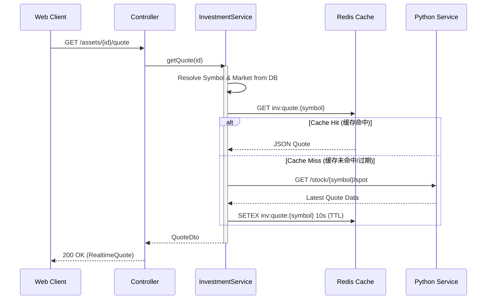

# 实时行情流程 (Realtime Quote Flow)

## 概述
当用户访问自选列表或标的详情页时，前端会轮询请求后端获取最新的行情数据。后端采用多级缓存策略，优先从 Redis 读取，未命中或过期时再从 Python Service 获取，以降低延迟并保护上游接口。

## 参与组件
1.  **Web Client**: TanStack Query (Polling).
2.  **InvestmentController**: 接收 HTTP 请求。
3.  **InvestmentService**: 负责缓存逻辑。
4.  **Redis**: 缓存层 (Key: `inv:quote:{symbol}`).
5.  **Python Service**: 实时数据源。

## 流程图

## 缓存策略
1.  **TTL (Time To Live)**:
    *   **交易时段**: 设置较短的过期时间 (如 5-10 秒)，保证实时性。
    *   **非交易时段**: 设置较长的过期时间 (如 1 分钟甚至更久)，减少无用请求。
2.  **批量查询**:
    *   对于自选列表，前端应支持批量 ID 查询接口 (`POST /assets/quotes/batch`)。后端对应地使用 Redis `MGET` 和 Python 服务的批量接口，显著提升性能。

## 异常处理
*   **上游超时**: 如果 Python Service 或 AkShare 超时，应返回最后一次缓存的旧数据（如果存在），并在响应头中标记 `X-Data-Stale: true`，或者返回 HTTP 503。
